# EJERCICIO 1
## Determinar la Función de Transferencia del Siguiente Sistema:
### a) Sistema 1: 

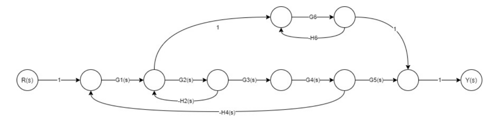
## 💻 Código en Octave

```octave
close all; clear all; clc;
pkg load symbolic

syms G1 G2 G3 G4 G5 G6 G2 H2 H4 H6 real

# CAMINOS DIRECTOS
K = 2;

# GANACIA DE LOS CAMINOS DIRECTOS
M1 = 1*G1*G2*G3*G4*G5*1;
M2 = 1*G1*1*G6*1*1;

# LAZOS:
L1 = -H4*G1*G2*G3*G4;
L2 = -H2*G2;
L3 = -H6*G6;

# DETERMINANTE:
DELTA = 1-(L1+L2+L3)+(L1*L3+L2*L3);

# DETERMINANTE DE LOS DELTA K
DELTA_K1 = 1-(L3);
DELTA_K2 = 1;

# FT = Y(S) / R(S) = (M1*DELTA_K1 + M2*DELTA_K2) / DELTA
disp("FT = Y5 / Y1")
FT = simplify((M1*DELTA_K1 + M2*DELTA_K2) / DELTA)
disp(FT)
pretty(FT)

# HAGO UNA RESTA PORQUE NO PUEDO DETERMINAR CUAL ES LA RESPUESTA.
# SI LA RESTA ES CERO ES LA SOOLUCION Y_N
Y_A = (G1*(G6+G2*G3*G4*G5))  / ((G6*H6+1)*(G2*H2+G1*G2*G3*G4*H4+1));
Y_B = ((G1*G6)  / ((G6*H6+1)*(G2*H2+G1*G2*G3*G4*H4+1)))+ (G1*G2*G3*G4*G5*(G6*H6+1));
Y_C = (G1*(G6+G2*G3*G4*G5+G2*G3*G4*G5*G6*H6))  / ((G6*H6+1)*(G2*H2+G1*G2*G3*G4*H4+1));
Y_D = (G1*G6+G1*G2*G3*G4*G5*(G6*H6+1))  / ((G2*H2)+(G6*H6)+(G2*G6*H2*H6)+(G1*G2*G3*G4*H4)+(G1*G2*G3*G4*G6*H4*H6)+(G1*G2*G2*G3*G4*G6*H4*H6)+1);


disp("la resta C es:")  #OPCION CORRECTA
disp(simplify(Y_C-FT))

disp("la resta  A es:")
disp(simplify(Y_A-FT))
disp("la resta  B es:")
disp(simplify(Y_B-FT))
disp("la resta  D es:")
disp(simplify(Y_D-FT))
```
## ⚙️ Resultados obtenidos
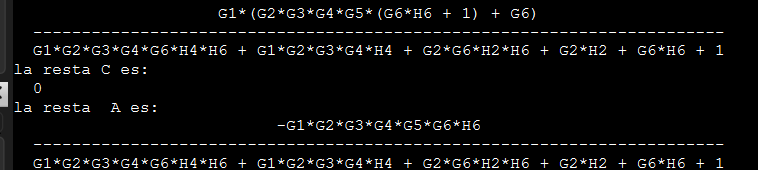
---
# EJERCICIO 2
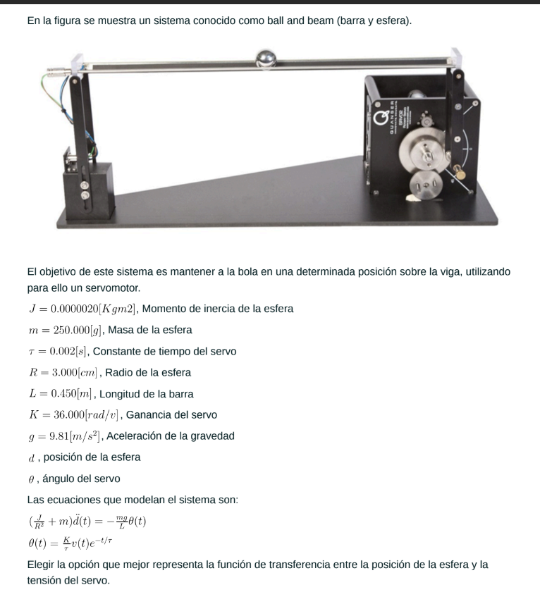
## 💻 Código en Octave

```octave
close all; clear all; clc;
pkg load symbolic
pkg load control
syms J m t R L K g tita V D s real

# ecuacion de la posicion de la esfera:
ec_1 = (J/(R*R)+m)*(s*s)*D == ((-m*g)/L)*tita
# ecuacion del angulo del servomotor
ec_2 = tita == (K/t)*V*(1/(s+(1/t)))
# creo unaestructura con campos D Y V
s=solve(ec_1,ec_2,D,V);
disp("D:")
disp(s.D)
disp("V:")
disp(s.V)

D_V = simplify(s.D/s.V)
# me devuelve una ecuacion
# de esa ecuacion simplificada remplazo valores 
J = 0.000002 ; # kg*m^2
m = 0.250; # kg
t = 0.002; # segundos
R = 0.03; # metros
L = 0.450; # metros
K = 36; # rad/v
g = 9.81; # m/s^2

s = tf('s');
D_V = (K*R*R*g*m)/(L*s*s*(J+R*R*m)*(s*t+1))

```
## ⚙️ Resultados obtenidos
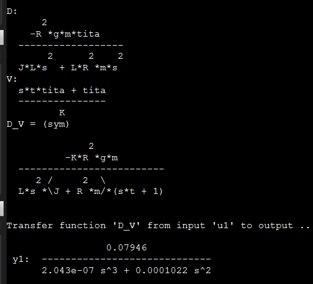
---
# EJERCICIO 3
### En la figura se muestra la respuesta al escalón unitario de un cierto sistema.
### Identificar el sistema e indicar cuál de las siguientes funciones de transferencia puede caracterizar de mejor manera al sistema.

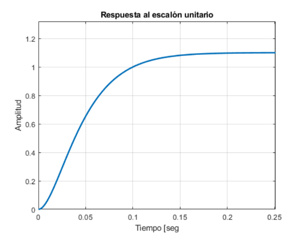
## 💻 Código en Octave

```octave
close all; clear all; clc;


# ganancia del sistema 
#valorregimen de salida/valor regimen entrada
k = 1.15;
# valor de establecimiento
v_est = 0.98*1.15;#1,127
# tiempo de estableciemiento
# t(v_est)
t =0.13750
# tau = t/4
tau = t/4;#0.034375

G = tf(k,[tau 1])
#step(G,0.25);grid
## con estp se aprovxima peroe s de primer orden
#comparo con las rtas 
s=tf('s');
#G1=1.1/ (0.025*s -1)^2;
G2=1.1/ (0.025*s+1);
#G3=1.1/ (0.05*s +1)^2;
#G4=1.1/ (0.1*s +1)^2;
G5=1.1/ (0.025*s +1)^2;
step(G2,G5,0.25);grid minor;

#FUI DESCARTANDO CUAL SE PARECE MAS.
#SE CONCLUYE QUE ES G5 PORQUE EN 0,1 VALE 1. 
#IGUAL QUE LA CONSIGNA
```
## ⚙️ Resultados obtenidos
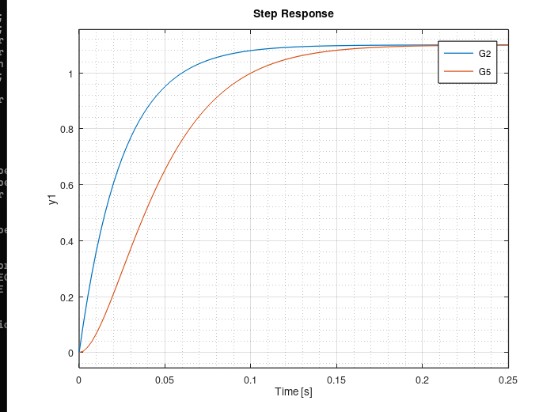
---

---
# EJERCICIO 4


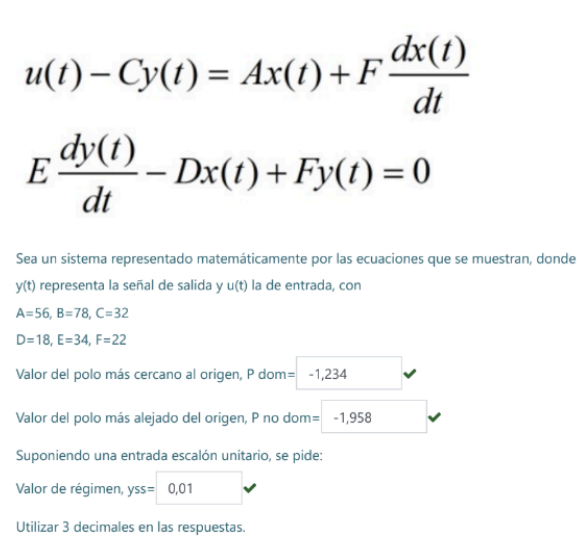
## 💻 Código en Octave

```octave
clear all; clc; close all;
pkg load control;
pkg load symbolic;

syms U C Y A F X E D B s real

eq1 = U - C*Y == A*X + F*s*X;
eq2 = E*s*Y - D*X + F*Y == 0;
Sol = solve(eq1,eq2,U,Y);
disp('Función de Transferencia del Sistema: ')
G = factor(Sol.Y/Sol.U,s,'s')
%Valores:
A=56;
B=78;
C=32;
D=18;
E=34;
F=22;
%Función de Transferencia con valores:
G = eval(G)
s = tf('s');
G = 18/(748*s^2+2388*s+1808);
pole(G) %Polos:
%Para una entrada escalón unitario: TVF
disp('Valor Regimen:')
Vf=18/1808#da 0.0099558
#suponer aprximado con 0.01
step(G); %Graficamos
```
## ⚙️ Resultados obtenidos
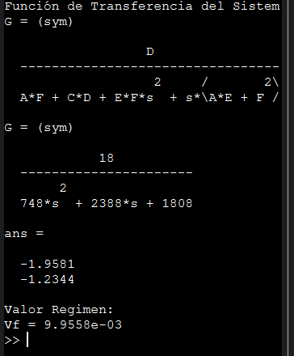
---

---
# EJERCICIO 5


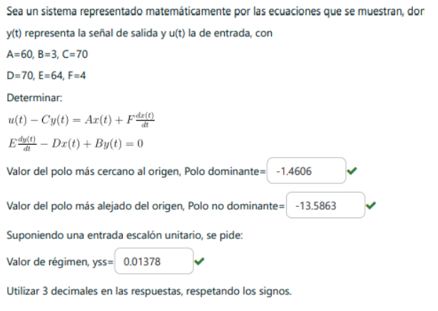
## 💻 Código en Octave

```octave
clear all; clc; close all;
pkg load control;
pkg load symbolic;

syms U C Y A F X E D B s real

eq1 = U - C*Y == A*X + F*s*X;
eq2 = E*s*Y - D*X + B*Y == 0;
Sol = solve(eq1,eq2,U,Y);
disp('Función de Transferencia del Sistema: ')
G = factor(Sol.Y/Sol.U,s,'s')
%Valores:
A=60;
B=3;
C=70;
D=70;
E=64;
F=4;
%Función de Transferencia con valores:
G = eval(G)
s = tf('s');
G = D/(A*B + C*D + E*F*s^2 + s*(A*E +B*F));
pole(G) %Polos:
%Para una entrada escalón unitario: TVF
disp('Valor Regimen:')
Vf=D/(A*B + C*D + E*F*0^2 + 0*(A*E +B*F))
step(G); %Graficamos
```
## ⚙️ Resultados obtenidos
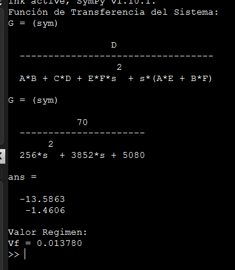
---


---
# EJERCICIO 6


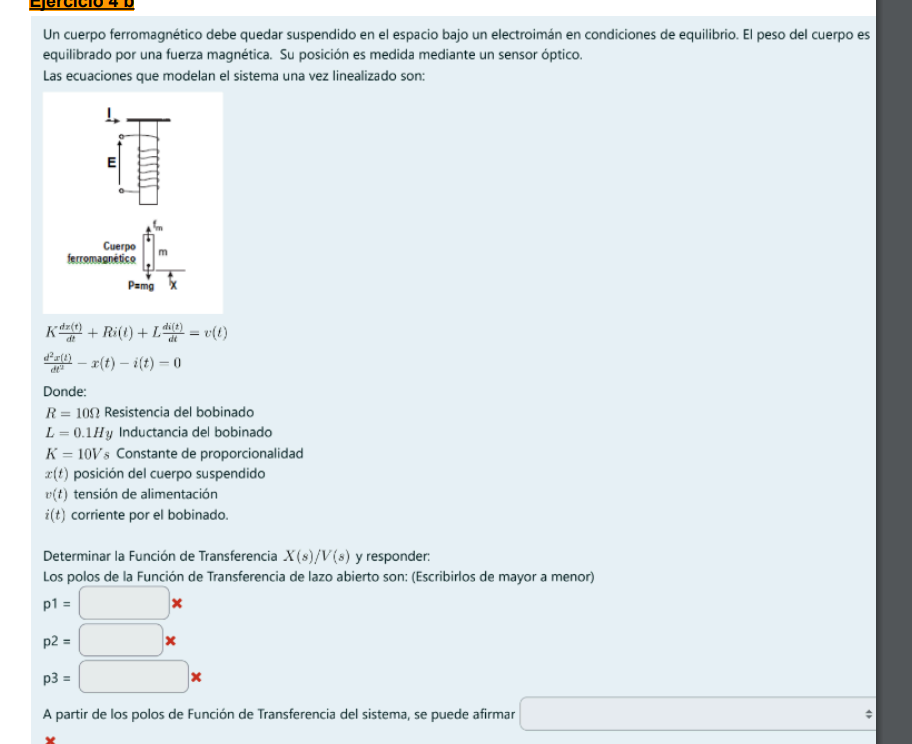
## 💻 Código en Octave

```octave
clear all; clc; close all;
pkg load control;
pkg load symbolic;
syms K R L I s X Y V real
eq1=K*s*X+R*I+L*s*I==V;
eq2=(s^2)*X-X-I==0;
Sol=solve(eq1,eq2,V,X);
disp('Función de Transferencia del Sistema: ')
G=factor(Sol.X/Sol.V,s,'s')
# Valores:
R=10;
L=0.1;
K=10;
# Función de Transferencia con valores:
s=tf('s');
FT = 1 / ( L*s^3 + R*s^2 - R + s*(K-L)  )

pole(FT)

# El sistema es inestable
```
## ⚙️ Resultados obtenidos
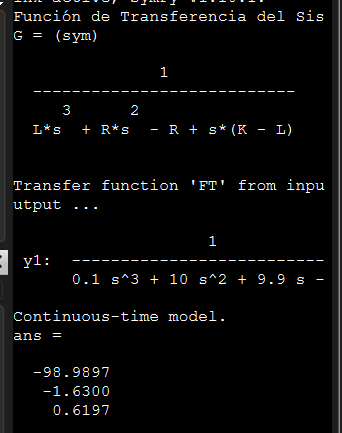
---


---
# EJERCICIO 7


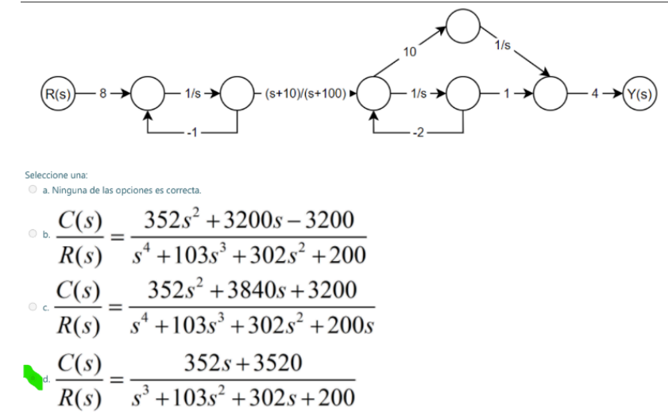
## 💻 Código en Octave

```octave
clear all; clc; close all;
pkg load symbolic;
syms s real

# caminos directos:
K = 2;
# ganancia de los caminos directos:
M1 = 8*(1/s)*( (s+10)/(s+100) )*(1/s)*4;
M2 = 8*(1/s)*( (s+10)/(s+100) )*10*(1/s)*4;

# LAZOS
L1 = -1*(1/s);
L2 = -2*(1/s);

# DETERMINANTE
DELTA = 1 - (L1+L2) + (L1*L2);

# DETERMINANTE DELTA_K
DELTA_K1 = 1;
DELTA_K2 = 1;

# Y(S) / R(S) =
FT = simplify((M1*DELTA_K1 + M2*DELTA_K2)/ DELTA)

% Expandir y simplificar completamente
FT_expanded = expand(FT);
FT_simplified = simplify(FT_expanded);

% Obtener numerador y denominador por separado
[num, den] = numden(FT_simplified);

% Expandir numerador y denominador
num_expanded = expand(num);
den_expanded = expand(den);

% Multiplicar numerador y denominador por s^3 para eliminar fracciones
num_final = expand(num_expanded * s^3);
den_final = expand(den_expanded * s^3);

% Simplificar factores comunes
FT_final = simplify(num_final / den_final);

% Obtener la forma final
[num_clean, den_clean] = numden(FT_final);

disp('Numerador expandido:');
disp(expand(num_clean));

disp('Denominador expandido:');
disp(expand(den_clean));

disp('Función de transferencia final C(s)/R(s):');
disp('Numerador:'), disp(collect(expand(num_clean), s));
disp('Denominador:'), disp(collect(expand(den_clean), s));
```
## ⚙️ Resultados obtenidos
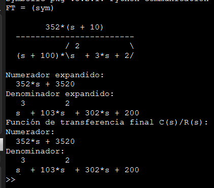
---


---
# EJERCICIO 8


## 💻 Código en Octave

```octave

```
## ⚙️ Resultados obtenidos

---