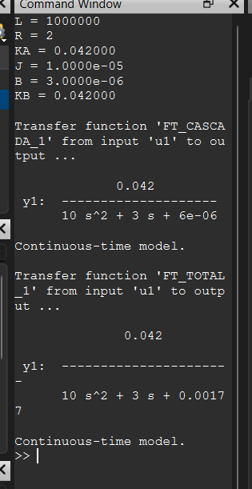

# 📝 3) 
## En la figura se muestra el diagrama de bloques de un motor de corriente continua, donde E(s) representa la entrada de tensión, W(s) la salida de velocidad del eje,    I(s) la corriente que circula por el motor y T_L(S) la carga del sistema, que puede verse como una perturbación. Se pide: 
### 3.1. Determinar las cuatro funciones de transferencia que modelan el sistema.  
### 3.2. Simular la respuesta del sistema para e(t)=24*u(t)  y T_L(t)=0.01*u(t-2)
---

## 💻 Código en Octave
```octave
# UNIDAD 2 . EJERCICIO NRO 3
close all; clear all; clc
pkg load control
pkg load symbolic
syms s L R KA J B KB
#s = tf('s');
#DEFINO LAS VARIABLES:
#L = 1*10^6#HENRIOS H
#R = 2#OHMS
#KA = 0.042 #Nm/A
#J = 10*10^(-6) #Kgm^2
#B = 0.30*10^(-5) #N / rad / seg
#KB = 0.042 # V / rad / seg
#DEFINO LOS PLANTAS:
G1 = 1 / (L*s + R);
G2 = 1 / (J*s + B);
#DEFINO LOS SISTEMAS
#FT_TOTAL_1 = W(s) / E(S)
FT_CASCADA_1 = G1 * KA * G2
FT_TOTAL_1 = minreal(FT_CASCADA_1 / (1+KB*FT_CASCADA_1))

#FT_TOTAL_1 = feedback(FT_CASCADA_1,KB)


```
## ⚙️ Resultados obtenidos


---
CASO PARA ENTRADA TL(S) CON E(S)=0
W(S)/TL(S)
```octave
# UNIDAD 2 . EJERCICIO NRO 3
# UNIDAD 2 . EJERCICIO NRO 3

close all; clear all; clc
pkg load control
pkg load symbolic
syms s L R KA J B KB
#s = tf('s');
#DEFINO LAS VARIABLES:
#L = 1*10^6#HENRIOS H
#R = 2#OHMS
#KA = 0.042 #Nm/A
#J = 10*10^(-6) #Kgm^2
#B = 0.30*10^(-5) #N / rad / seg
#KB = 0.042 # V / rad / seg
#DEFINO LOS PLANTAS:aa
G1 = 1 / (L*s + R)
G2 = 1 / (J*s + B)
#DEFINO LOS SISTEMAS
#FT_TOTAL_1 = W(s) / TL(S)
FT_CASCADA_1 = simplify(G1 * KA * KB)
FT_TOTAL_1 = simplify(G2 / (1+G2*FT_CASCADA_1))

#FT_TOTAL_1 = feedback(FT_CASCADA_1,KB)
```
## ⚙️ Resultados obtenidos


---

### EJERCICIO 5. 
## Encontrar G*(S) de manera tal que los sistemas que se muestran a continuación sean equivalentes.


## 💻 Código en Octave

```octave

```
## ⚙️ Resultados obtenidos

---