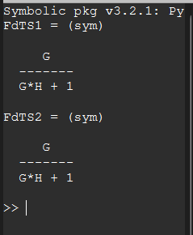
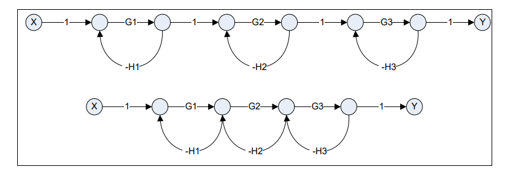
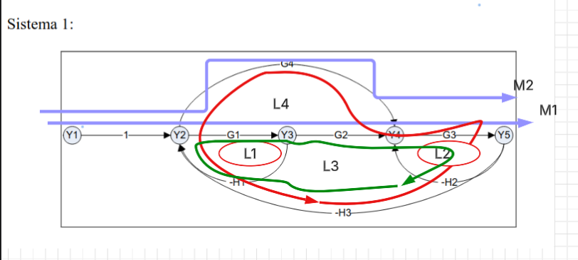
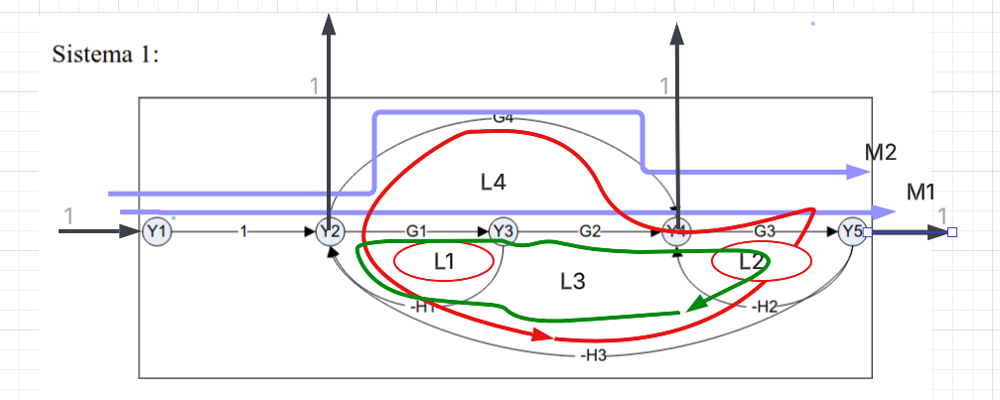
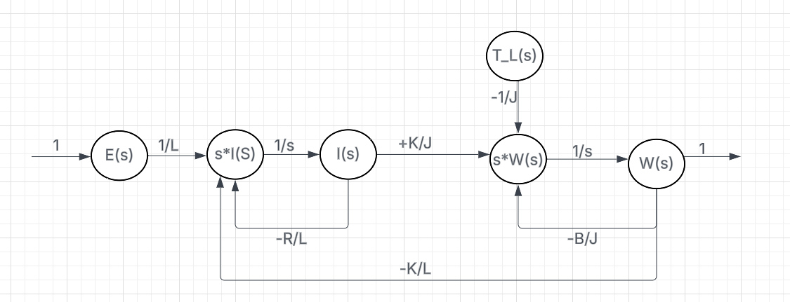
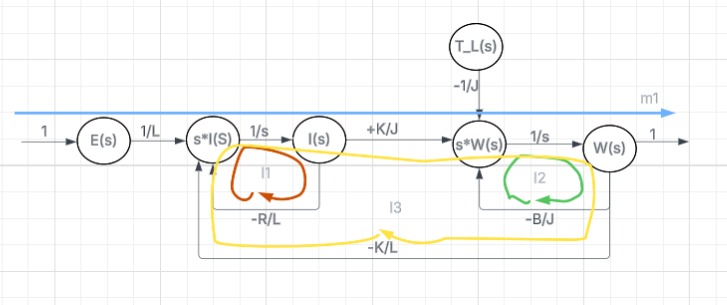

# Diagramas de Flujo de Señal y Álgebra de Mason
## 6. Demostrar que los siguientes sistemas son equivalentes.


## 💻 Código en Octave

```octave
% Sistemas de Control
% Unidad 2 - Ejercicio 6
pkg load symbolic
close all; clear all; clc
% Definición de las funciones.
syms G H real
% Sistema 1.
M1=G;
l1=-G*H;
D=1-l1;
D1=1;
FdTS1=M1*D1/D
% Sistema 2.
M1=G;
l1=-G*H;
D=1-l1;
D1=1;
FdTS2=M1*D1/D

```
## ⚙️ Resultados obtenidos

---
---


## 7. Demostrar que los siguientes sistemas no son equivalentes.


## 💻 Código en Octave

```octave
% Sistemas de Control
% Unidad 2 - Ejercicio 7
pkg load symbolic
close all; clear all; clc
% Definición de las funciones.
syms G1 G2 G3 H1 H2 H3 real
% Función de Transferencia del sistema 1.
M1=G1*G2*G3;
l1=-G1*H1;
l2=-G2*H2;
l3=-G3*H3;
D=1-(l1+l2+l3)+(l1*l2+l1*l3+l2*l3)-(l1*l2*l3);
D1=1;
disp('Función de Transferencia del Sistema 1')
FdTLCs1=factor(simplify(M1*D1/D),'s')
% Función de Transferencia del sistema 2.
M1=G1*G2*G3;
l1=-G1*H1;
l2=-G2*H2;
l3=-G3*H3;
D=1-(l1+l2+l3)+(l1*l3);
D1=1;
disp('Función de Transferencia del Sistema 2')
FdTLCs2=factor(simplify(M1*D1/D),'s')

```
## ⚙️ Resultados obtenidos

---

## 10. Aplicar la Regla de Mason para encontrar las siguientes Funciones de Transferencia

### Sistema 1: 

lazos y caminos directos:

las 3 salidas paracada para las 3 distintas FT que utilizan mismo determinante:

## 💻 Código en Octave

```octave
close all; clear all; clc
pkg load symbolic
syms  G1 G2 G3 G4 H1 H2 H3 real

# CAMINOS DIRECTOS:
a_K=2;

# GANANCIA DE LOS CAMINOS DIRECTOS
a_M1 = 1*G1*G2*G3;
a_M2 = 1*G4*G3;

# LAZOS:
L1 = -H1*G1;
L2 = -H2*G3;
L3 = -H3*G1*G2*G3;
L4 = -H3*G4*G3;

# VALOR DEL DETERMINANTE
# TENIENDO EN CUENTA TODO EL DIAGRAMA
# DETERMINANTE = 1 - SUMATORIA DE GANANCIA DE LOS LAZOS
#                  + SUMATORIA LAZOS DISJUNTOS DE A 2
#                  - SUMATORIA LAZOS DISJUNTOS DE A 3 ETC
# LAZOS DISJUNTOS : "LAZOS QUE NO COMPARTEN NODOS"
DELTA = 1 - (L1+L2+L3+L4) + (L1*L2);

# GANANCIA DE LOS DELTA_K
# LO MISMO COMO EL DETERMINANTE PERO TENIENDO EN 
# CUENTA LOS CAMINOS DIRECTO
a_DELTA_K1 = 1 ;
a_DELTA_K2 = 1;

# FT = Y5 / Y1 = (M1*DELTA_K1 + M2*DELTA_K2) / DELTA
disp("FT = Y5 / Y1")
a_FT = (a_M1*a_DELTA_K1 + a_M2*a_DELTA_K2) / DELTA;
disp(a_FT)
###########################
# FT = Y4 / Y1

# CAMINOS DIRECTOS
b_K =2;

# GANANCIA DE LOS CAMINOS DIRECTOS
b_M1 = 1*G1*G2*1;
b_M2 = 1*G4*1;

# LAZOS Y DEETERMINANTES MISMO PARA EL SISTEMA
# ES "DELTA" CALCULADO ANTERIORMENTE

# GANANCIA DE LOS DELTA_K
b_DELTA_K1 = 1;
b_DELTA_K2 = 1;

# FT = Y4 / Y1 = (M1*DELTA_K1 + M2*DELTA_K2) / DELTA
disp("FT = Y4 / Y1")
b_FT = (b_M1*b_DELTA_K1 + b_M2*b_DELTA_K2) / DELTA;
disp(b_FT)
##############################
# FT = Y2 / Y1

# CAMINOS DIRECTOS 
c_K = 1;

# GANANCIA DE LOS CAMINOS DIRECTOS
c_M1 = 1;

# LAZOS Y DEETERMINANTES MISMO PARA EL SISTEMA
# ES "DELTA" CALCULADO ANTERIORMENTE

# GANANCIA DE LOS DELTA_K
c_DELTA_K1 = 1 - (L2);

# FT = Y2 / Y1 = (M1*DELTA_K1) / DELTA
disp("FT = Y2 / Y1")
c_FT = (c_M1*c_DELTA_K1) / DELTA;
disp(c_FT)

```
## ⚙️ Resultados obtenidos


### Y2/Y1   Y4/Y1

### Se utilizara el mismo determinante porque es el mismo sistema, ya que los lasos son los mismos para cada FT dentro

---

## 11. A partir de las ecuaciones que modelan matemáticamente el comportamiento dinámico de un motor de corriente continua, dibujar el diagrama de flujo de señal y determinar la función de transferencia entre la velocidad de salida y la tensión de entrada aplicando la fórmula de Mason






## 💻 Código en Octave

```octave

close all; clear all; clc
syms  L K J B R s real

# CAMINOS DIRECTOS:
K=1;

# GANANCIA DE LOS CAMINOS DIRECTOS
M1 = 1*(1/L)*(1/s)*(K/J)*(1/s)*1;

# LAZOS:
L1 = (-R/L)*(1/s);
L2 = (-B/J)*(1/s);
L3 = (-K/L)*(1/s)*(K/J)*(1/s);

# VALOR DEL DETERMINANTE
# TENIENDO EN CUENTA TODO EL DIAGRAMA
# DETERMINANTE = 1 - SUMATORIA DE GANANCIA DE LOS LAZOS
#                  + SUMATORIA LAZOS DISJUNTOS DE A 2
#                  - SUMATORIA LAZOS DISJUNTOS DE A 3 ETC
# LAZOS DISJUNTOS : "LAZOS QUE NO COMPARTEN NODOS"
DELTA = 1 - (L1+L2+L3) + (L1*L2);

# GANANCIA DE LOS DELTA_K
# LO MISMO COMO EL DETERMINANTE PERO TENIENDO EN 
# CUENTA LOS CAMINOS DIRECTO
DELTA_K1 = 1 ;


# FT = W(s)/E(s) = (M1*DELTA_K1) / DELTA
FT = (M1*DELTA_K1) / DELTA

```
## ⚙️ Resultados obtenidos

---
