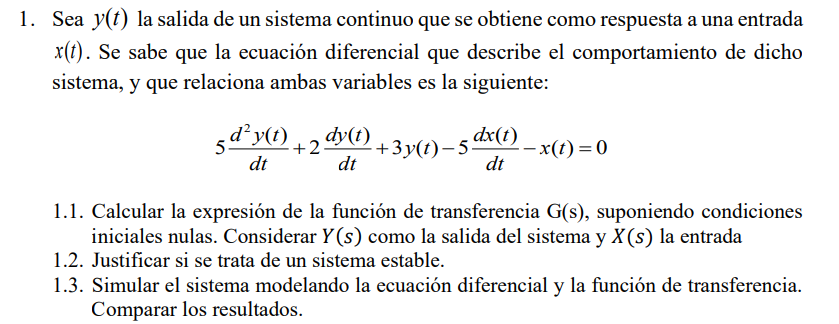
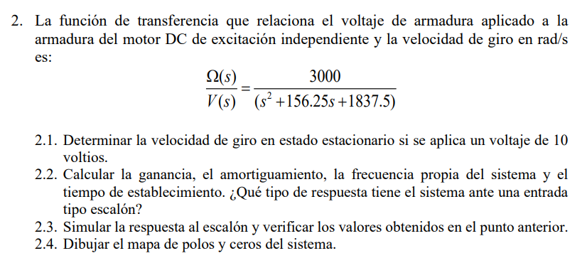
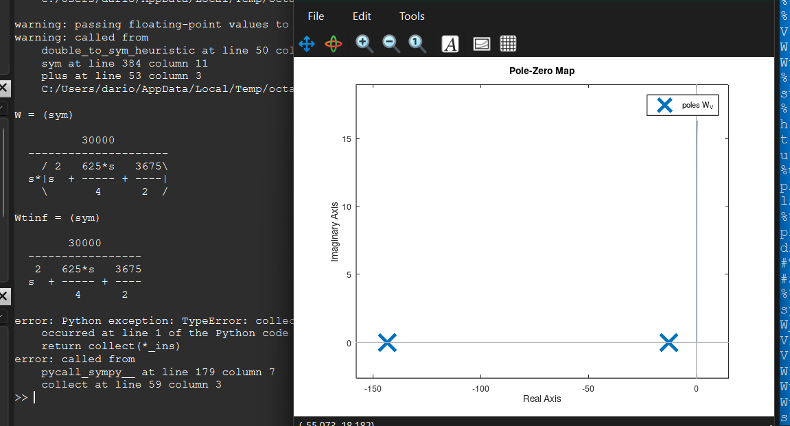

# 📘 Unidad N° 3: * Modelado Matemático de Sistemas Físicos*
## Generalidades


## 💻 Código en Octave

```octave
% Unidad N° 3 Ejercicio 1
close all; clear all; clc
% Ec Dif:
% 5DDy+2Dy+3y-5Dx-x=0
% 1.1 Determinar Y(s)/X(s)
% Primero:
% y(t) -> Y(s)
% Dy(t) -> sY(s)
% DDy(t) -> s^2Y(s)
% x(t) -> X(s)
% Dx(t) -> sX(s)
% 5s^2Y(s)+2sY(s)+3Y(s)=5sX(s)+X(s)
% Segundo:
% Y(s)(5s^2+2s+3)=X(s)(5s+1)
% Tercero:
% Y(s)(5s^2+2s+3)/X(s)=(5s+1)
% Y(s)/X(s)=(5s+1)/(5s^2+2s+3)
s=tf('s');
Ys_Xs=(5*s+1)/(5*s^2+2*s+3)
% 1.2 Determinar la estabilidad.
p=pole(Ys_Xs);
if real(p)<0
 disp('Sistema Estable')
else
 disp('Sistema Inestable')
endif
%roots([5 2 3])
% 1.3 Simulación
step(Ys_Xs,50)
% ramp(Ys_Xs,50)

disp('Terminado')

```
## ⚙️ Resultados obtenidos


---



## 💻 Código en Octave

```octave
% Unidad N° 3 Ejercicio 2
close all; clear all; clc
%% Función de Transferencia del sistema:
s = tf('s');
%syms s real
W_V = 3000 / (s^2 + 156.25*s + 1837.5);
Vin = 10; % Voltaje de entrada
%% 1. Velocidad si Vin = 10;
% Aplicando el teorema del valor final w = 16.32 rad/seg
V = Vin / s;
W = W_V * V;
Wtinf = dcgain(s * W); % w = 16.32 rad/seg
% Por simulación
step(Vin * W_V);grid % w = 16.32 rad/seg
% Para usar la función lsim creamos un escalón de 10v
h = 1e-3;
t = 0:h:0.5;
u = 10 * ones(size(t));
%u = 10 * ones(1, length(t));
plot(t, u,'o', 'linewidth', 2); grid on
lsim(W_V, u, t); grid
%% Dibujar el diagrama de polos y ceros
pzmap(W_V);grid
disp('Terminado')
#También se puede resolver usando el paquete de matemática
#simbólica:
%% Función de Transferencia del sistema:
syms s real
W_V = 3000 / (s^2 + 156.25*s + 1837.5);
Vin = 10; % Voltaje de entrada
V = Vin / s;
W = collect(W_V * V,'s')
Wtinf = W * s % Para aplicar el teorema del valor final
Wtinf = collect(Wtinf)
s = 0; eval(Wtinf) % w = 16.32 rad/seg
```
## ⚙️ Resultados obtenidos

---
