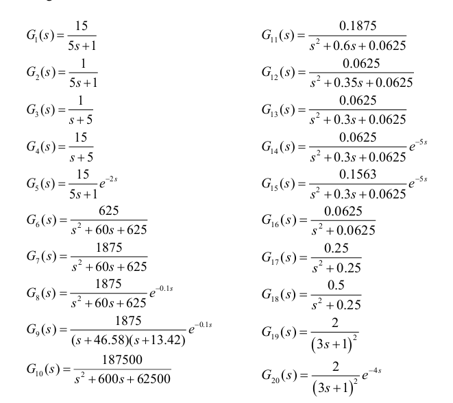
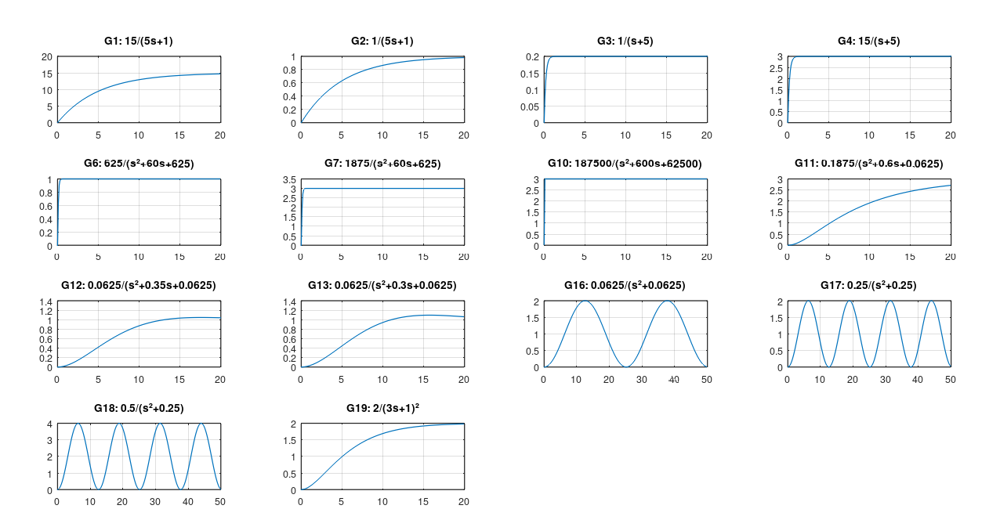

# 📘 Unidad Nº 4: *Análisis y Diseño Clásico de Sistemas de Control en el Dominio del Tiempo*
## Respuesta Temporal de Sistemas de Primer Orden


## 💻 Código en Octave

```octave
close all; clear all; clc;
pkg load control

s = tf('s');

% Definir todos los sistemas
G1 = 15/(5*s+1);
G2 = 1/(5*s+1);
G3 = 1/(s+5);
G4 = 15/(s+5);
G6 = 625/(s^2+60*s+625);
G7 = 1875/(s^2+60*s+625);
G10 = 187500/(s^2+600*s+62500);
G11 = 0.1875/(s^2+0.6*s+0.0625);
G12 = 0.0625/(s^2+0.35*s+0.0625);
G13 = 0.0625/(s^2+0.3*s+0.0625);
G16 = 0.0625/(s^2+0.0625);
G17 = 0.25/(s^2+0.25);
G18 = 0.5/(s^2+0.25);
G19 = 2/(3*s+1)^2;

% Una sola gráfica con todas las respuestas
figure;
step(G1, G2, G3, G4, G6, G7, G10, G11, G12, G13, G16, G17, G18, G19);
grid on;
legend('G1', 'G2', 'G3', 'G4', 'G6', 'G7', 'G10', 'G11', 'G12', 'G13', 'G16', 'G17', 'G18', 'G19', 'Location', 'best');
title('Todas las Respuestas al Escalón');
```
## ⚙️ Resultados obtenidos



---

