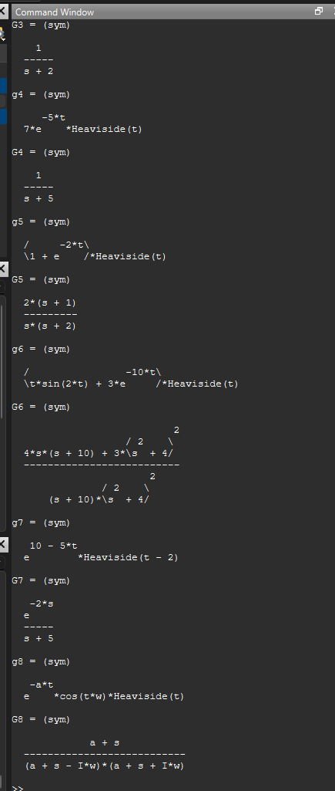
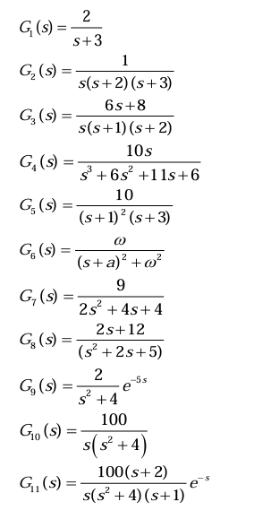

# 📘 Unidad N° 1: *Introduccion a los sistemas de control*

---
## 📝 6) Transformadas de Laplace
Escribir las trasnformadas de laplace de las siguientes funciones. Verificar utilizando Matlab:
---

$g_1(t) = \delta(t)$  
$g_2(t) = u(t)$  
$g_3(t) = e^{-2t} u(t)$  
$g_4(t) = 7 e^{-5t} u(t)$  
$g_5(t) = (1 + e^{-2t}) u(t)$  
$g_6(t) = (t \sin(2t) + 3 e^{-10 t}) u(t)$  
$g_7(t) = e^{-5 (t-2)} u(t-2)$  
$g_8(t) = e^{-\alpha t} \cos(\omega t) u(t)$  

---

## 💻 Código en Octave

```octave
% ====================================
%  Ejercicio 6 - Resolución en Octave
% ====================================

#pkg load symbolic
close all; clear all; clc

# unidad nro 1 - ejercicio 6

#disp("unidad 1 ejercicio nro 6")

syms t s a w real
#impulso
g1 = dirac(t)
G1 = laplace(g1)
#escalon
g2 = heaviside(t)
G2 = laplace(g2)

g3 = exp(-2*t)*heaviside(t)
G3 = laplace(g3)

g4 = 7*exp(-5*t)*heaviside(t)
G4 = laplace(g4)

g5 = (1+exp(-2*t))*heaviside(t)
G5 = laplace(g5)

g6 = (t*sin(2*t) + 3*exp(-10*t)) * heaviside(t)
G6 = laplace(g6)

g7 = exp(-5*(t-2))*heaviside(t-2)# me la simplifico
G7 = laplace(g7)

g8 = exp(-a*t)*cos(w*t)*heaviside(t) # cargar simbolos nuevos
G8 = laplace(g8)
##################################
##################################
##################################

#si yo quiero graficarlas debo convertir estas
#funciones simbolicas a funciones numericas

f1 = matlabFunction(g1);
l1 = matlabFunction(g1);

f2 = matlabFunction(g2);
l2 = matlabFunction(g2);

f3 = matlabFunction(g3);
l3 = matlabFunction(g3);

f4 = matlabFunction(g4);
l4 = matlabFunction(g4);

f5 = matlabFunction(g5);
l5 = matlabFunction(g5);

f6 = matlabFunction(g6);
l6 = matlabFunction(g6);

f7 = matlabFunction(g7);
l7 = matlabFunction(g7);

# defino el dominio del tiempo "t"
tv=linspace(0,5,500); # desde 0 a 5 segundos
sv=linspace(0.1,10,500); # desde 0 a 5

# Graficar con subplots
figure;
subplot(2,7,1); plot(tv, f1(tv)); title('g1 = dirac(t)');
subplot(2,7,2); plot(sv, l1(sv)); title('l1 ');

subplot(2,7,3); plot(tv, f2(tv)); title('g2 = heaviside(t)');
subplot(2,7,4); plot(sv, l2(sv)); title('l2 ');

subplot(2,7,5); plot(tv, f3(tv)); title('g3 = e^{-2t}·u(t)');
subplot(2,7,6); plot(sv, l3(sv)); title('l3 ');

subplot(2,7,7); plot(tv, f4(tv)); title('g4 = 7·e^{-5t}·u(t)');
subplot(2,7,8); plot(sv, l4(sv)); title('l4 ');

subplot(2,7,9); plot(tv, f5(tv)); title('g5 = (1 + e^{-2t})·u(t)');
subplot(2,7,10); plot(sv, l5(sv)); title('l5 ');

subplot(2,7,11); plot(tv, f6(tv)); title('g6 = t·sin(2t) + 3·e^{-10t}');
subplot(2,7,12); plot(sv, l6(sv)); title('l6 ');

subplot(2,7,13); plot(tv, f7(tv)); title('g7 = e^{-5(t-2)}·u(t-2)');
subplot(2,7,14); plot(sv, l7(sv)); title('l7 ');
sub

```


## ⚙️ Resultados obtenidos

Las transformadas de Laplace calculadas fueron:




---
## 📝 7) Transformada Inverza
Encontrar las Transformadas Inversas de Laplace de las siguientes funciones. 
Verificar utilizando Matlab. 
---




---
## 💻 Código en Octave

```octave
#ejercicio 7 
%hallar las transformadas inverza de laplace

pkg load control
pkg load symbolic
clear all ;close all;clc

syms t s w a real

G1 = 2 / (s+3)
g1 = simplify(ilaplace(G1))

G2 = 1 / (s*(s+2)*(s+3))
g2 = simplify(ilaplace(G2))

G3 = (6*s + 8) / (s*(s+1)*(s+2))
g3 = simplify(ilaplace(G3))

G4 = (10*s)  / (s^3 + 6*s^2 + 11*s + 6)
g4 = simplify(ilaplace(G4))

G5 = (10) / ((s+1)^2 *  (s+3))
g5 = simplify(ilaplace(G5))

G6 = w / ((s+a)^2 + w^2)
g6 = simplify(ilaplace(G6))

G7 = 9 / (2*s^2 + 4*s + 4)
g7 = simplify(ilaplace(G7))

G8 = (2*s + 12) / (s^2 + 4*s + 4)
g8 = simplify(ilaplace(G8))

G9 = (2 / (s^2 + 4))  * exp(-5*s)
g9 = simplify(ilaplace(G9))

G10 = 100 / (s * (s^2+4) )
g10 = simplify(ilaplace(G10))

G11 = (100*(s+2) / (s*(s^2+4)*(s+1)))  * exp(-s)
g11 = simplify(ilaplace(G11))

```

## ⚙️ Resultados obtenidos

Las transformadas de Inverzas de Laplace calculadas fueron:
---


