# 📘 Unidad N° 2: *Representacion matematicas y grafica de sistemas lineales en tiempo continuo*
# 📝 2) Funciones de Transferencia de Circuitos Básicos
## 1. Determinar la función de transferencia que relaciona la tensión de salida con la tensión de entrada de los siguientes circuitos. Comparar los resultados.

### Circuito N° 1:
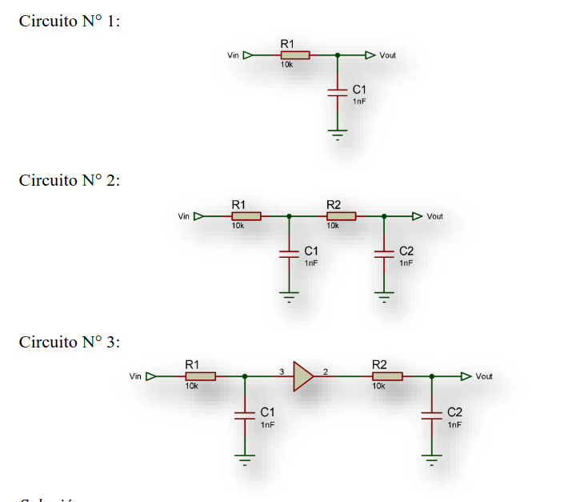
```octave
close all; clear all; clc
syms R1 R2 C1 C2 s

# CIRCUITO 1:
# v(s) = i(s) * (r +(1/ (s*c)))
# i(s) = v(s) / (r +(1/ (s*c)))

# v_o(s) =        i(s) * (1/ (s*c)))
# v_i(s) = v(s) = i(s) * (r +(1/ (s*c)))
#                  ------------------
# v_o(s)/v_i(s) = (1/(s*c))) / (r +(1/(s*c)))

FT_1 = 1 / (s*C1*R1 + 1)
##########################
# CIRCUITO 2:
syms Vin I1 I2 Vout real
X1 = 1 / (s*C1);
X2 = 1 / (s*C2);
ec_1 = Vin == I1*(R1+X1) - I2*X1;
ec_2 = 0 == (-I1)*X1 + I2*(R2+X2+X1);
# DESPEJO I1 de ec_2
I1 = ((I2*(R2+X2+X1)) / X1) ;
#ec_3 = Vin == I1*(R1+X1) - I2*X1
ec_3 = Vin == ((I2*(R2+X2+X1)) / X1)*(R1+X1) - I2*X1;
# vout = I2 * X2
I2 = (Vout/X2);
#remplazo I2 EN E_4
#ec_4 = Vin == ((I2*(R2+X2+X1)) / X1)*(R1+X1) - I2*X1
ec_4 = Vin == (((Vout/X2)*(R2+X2+X1)) / X1)*(R1+X1) - (Vout/X2)*X1;
S = solve(ec_4,Vout);
G2 = S / Vin

disp("=== Termino el programa ===")
#########################
# CIRCUITO 3
# Esta compuesta por FT_1 CALCULADA ANTERIORMENTE
# Y una mas parecida: FT_2
FT_1 = 1 / (s*C1*R1 + 1) # LA YA CALCULADA
FT_2 = 1 / (s*C2*R2 + 1)
#Luego por propeidad de cascada
G3 = FT_1 * FT_2

```
## ⚙️ Resultados obtenidos
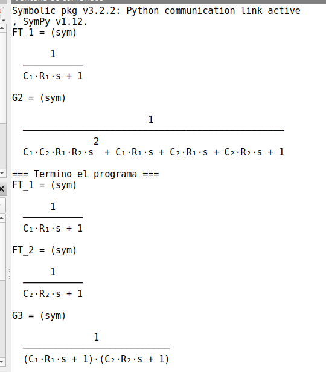
#### En el circuito 2 cualquier modificaciond e valores de R Y C afecta a todos los polos. En cambio en el circuito 3 cualquier modificacion r1 c1 r2 c2 afecta a un solo polo. Esto se logra con el buffer para separar circuito
---

# 📝 2) Algebra de bloques 
## Obtener la funcion de transferencia de los siguientes sistemas utilizando el algebra de bloques. Simular la respuesta al escalon.
---
### Sistema 1: sistema a lazo cerrado con realimentacion tacométrica

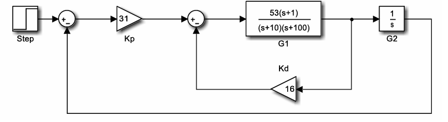
## 💻 Código en Octave

```octave
# UNIDAD 2 . EJERCICIO NRO 2. sistema 1
close all; clear all; clc

s = tf('s');
#DEFINO LOS SISTEMAS:
kp = 31;
G1 = (53*(s+1)) / ((s+10)*(s+100));
kd = 16;
G2 = 1 / s;
#################

# USANDO MINREAL: SE USA PARA CANCELAR POLOS Y CEROS
disp("USANDO MINREAL")
FT_LC_1 = minreal(G1 / (1 + kd*G1))
FT_CASCADA = minreal(kp * G1 * G2)
FT_LC_TOTAL = minreal(FT_CASCADA/(1+FT_CASCADA))

disp("USANDO feedback")
#USNADO feedback: SE USA PARA SISTEMAS DE LAZO CERRADOS 
FT_LC_1 = feedback(G1,kd)
FT_CASCADA = minreal(kp * G1 * G2)
FT_LC_TOTAL = feedback(FT_CASCADA,1)

disp("termino el programa ")
```
## ⚙️ Resultados obtenidos
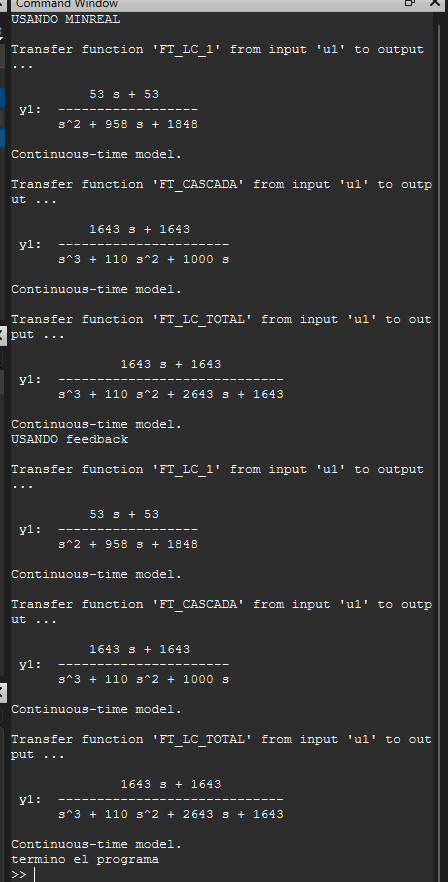

---

### Sistema 2: sistema de control en cascada
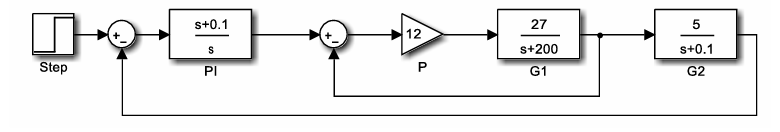
## 💻 Código en Octave

```octave
# UNIDAD 2 . EJERCICIO NRO 2. sistema 2
close all; clear all; clc
s = tf('s');
#DEFINO LOS SISTEMAS:
PI = (s+ 0.1) / s;
P = 12;
G1 = 27 / (s + 200);
G2 = 5 / (s + 0.1);
#################

FT_CASCADA1 = minreal(P * G1);
FT_LC_1 = minreal(FT_CASCADA1 / (1 + FT_CASCADA1))
FT_CASCADA_2 = minreal(FT_LC_1 * G2 * PI)
FT_LC_TOTAL = minreal(FT_CASCADA_2 / (1 + FT_CASCADA_2))

#usando feedback:2
FT_CASCADA1 = minreal(P * G1);
FT_LC_1 = feedback(FT_CASCADA1,1)
FT_CASCADA_2 = minreal(FT_LC_1 * G2 * PI)
FT_LC_TOTAL = feedback(FT_CASCADA_2,1)


disp("termino el programa ")


```
## ⚙️ Resultados obtenidos
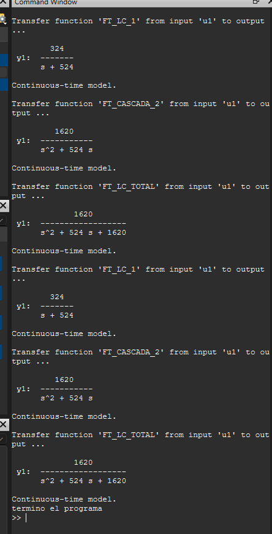

---

### Sistema 3: sistema de lazo cerrado con controlador PID
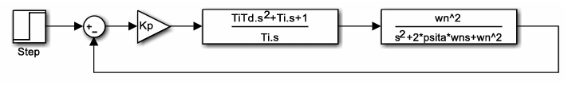
## 💻 Código en Octave

```octave
# UNIDAD 2 . EJERCICIO NRO 2. sistema 3
close all; clear all; clc
pkg load symbolic
#defino las variables simbolicas
syms  kp ti td s wn p real
#DEFINO LOS SISTEMAS:
PLANTA_1 = (ti*td*s^2+ti*s+1) / (ti*s)
PLANTA_2 = (wn^2) / (s^2+2*p*wn*s+wn^2)
#################

FT_CASCADA_1 = simplify(kp*PLANTA_1*PLANTA_2)
FT_LC_TOTAL = simplify(FT_CASCADA_1 / (1 + FT_CASCADA_1))

#como son variables simbolicas no
#puedo usar minreal ni feedback 
#esas necesitan de valores 
```
## ⚙️ Resultados obtenidos
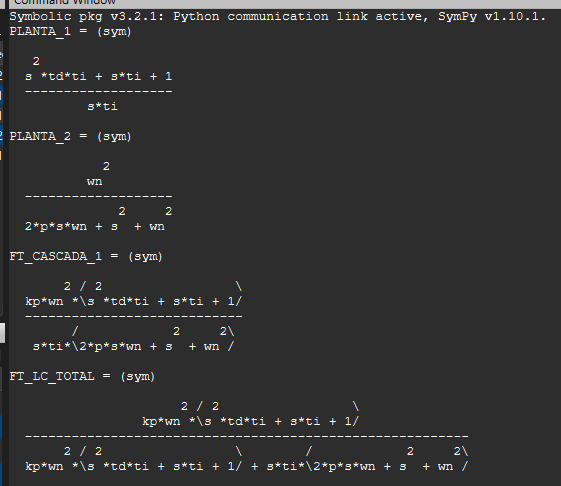
---

### Sistema 4: sistema de lazo cerrado con controlador PID
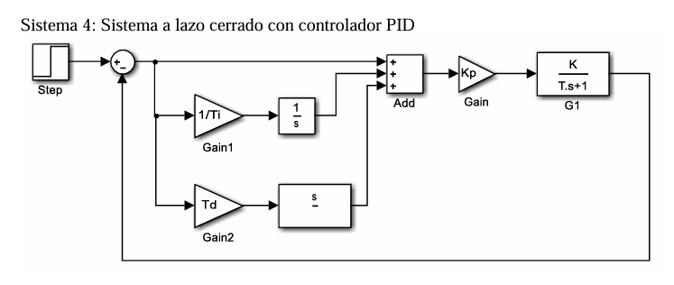
## 💻 Código en Octave

```octave
# UNIDAD 2 . EJERCICIO NRO 2. sistema 4
close all; clear all; clc
pkg load symbolic
syms ti td s kp t k 
#DEFINO LOS SISTEMAS:
GAIN_1 = 1/ti;
GAIN_2 = td;
GAIN_0 = kp;
G1 = k / (t*s+1);
FT_1 = 1/s;
FT_2 = s;
#################

FT_CASCADA_1 = GAIN_1*FT_1
FT_CASCADA_2 = GAIN_2*FT_2
FT_CASCADA_3 = GAIN_0*G1
ADD = simplify(1 + FT_CASCADA_1 + FT_CASCADA_2)
FT_CASCADA_TOTAL = simplify(ADD * FT_CASCADA_3)
FT_LC_1 = simplify(FT_CASCADA_TOTAL / (1+FT_CASCADA_TOTAL))

```
## ⚙️ Resultados obtenidos
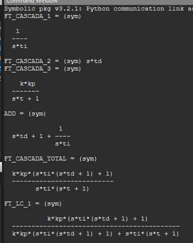

# 📝 3) 
## En la figura se muestra el diagrama de bloques de un motor de corriente continua, donde E(s) representa la entrada de tensión, W(s) la salida de velocidad del eje,    I(s) la corriente que circula por el motor y T_L(S) la carga del sistema, que puede verse como una perturbación. Se pide: 
### 3.1. Determinar las cuatro funciones de transferencia que modelan el sistema.  
### 3.2. Simular la respuesta del sistema para e(t)=24*u(t)  y T_L(t)=0.01*u(t-2)
---
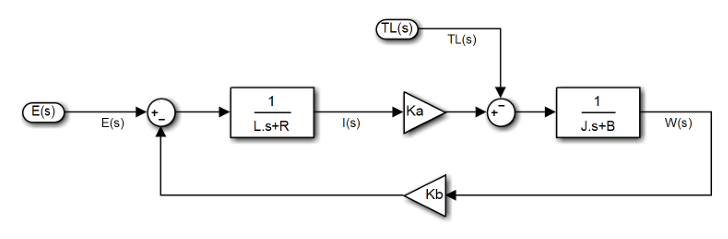
## 💻 Código en Octave
```octave
# UNIDAD 2 . EJERCICIO NRO 3
close all; clear all; clc
pkg load control
pkg load symbolic
syms s L R KA J B KB
#s = tf('s');
#DEFINO LAS VARIABLES:
#L = 1*10^6#HENRIOS H
#R = 2#OHMS
#KA = 0.042 #Nm/A
#J = 10*10^(-6) #Kgm^2
#B = 0.30*10^(-5) #N / rad / seg
#KB = 0.042 # V / rad / seg
#DEFINO LOS PLANTAS:
G1 = 1 / (L*s + R);
G2 = 1 / (J*s + B);
#DEFINO LOS SISTEMAS
#FT_TOTAL_1 = W(s) / E(S)
FT_CASCADA_1 = G1 * KA * G2
FT_TOTAL_1 = minreal(FT_CASCADA_1 / (1+KB*FT_CASCADA_1))

#FT_TOTAL_1 = feedback(FT_CASCADA_1,KB)


```
## ⚙️ Resultados obtenidos


---
CASO PARA ENTRADA TL(S) CON E(S)=0
W(S)/TL(S)
```octave
# UNIDAD 2 . EJERCICIO NRO 3
# UNIDAD 2 . EJERCICIO NRO 3

close all; clear all; clc
pkg load control
pkg load symbolic
syms s L R KA J B KB
#s = tf('s');
#DEFINO LAS VARIABLES:
#L = 1*10^6#HENRIOS H
#R = 2#OHMS
#KA = 0.042 #Nm/A
#J = 10*10^(-6) #Kgm^2
#B = 0.30*10^(-5) #N / rad / seg
#KB = 0.042 # V / rad / seg
#DEFINO LOS PLANTAS:aa
G1 = 1 / (L*s + R)
G2 = 1 / (J*s + B)
#DEFINO LOS SISTEMAS
#FT_TOTAL_1 = W(s) / TL(S)
FT_CASCADA_1 = simplify(G1 * KA * KB)
FT_TOTAL_1 = simplify(G2 / (1+G2*FT_CASCADA_1))

#FT_TOTAL_1 = feedback(FT_CASCADA_1,KB)
```
## ⚙️ Resultados obtenidos
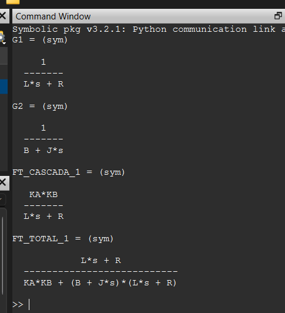

---

### EJERCICIO 5. 
## Encontrar G*(S) de manera tal que los sistemas que se muestran a continuación sean equivalentes.

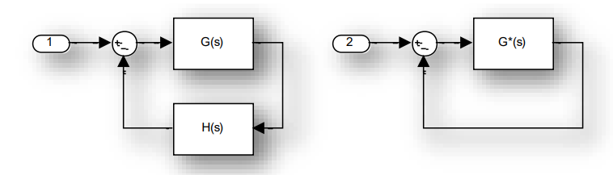
## 💻 Código en Octave

```octave

```
## ⚙️ Resultados obtenidos

---
---

# Diagramas de Flujo de Señal y Álgebra de Mason
## 6. Demostrar que los siguientes sistemas son equivalentes.

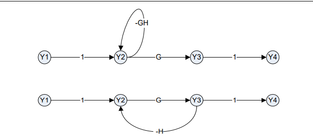
## 💻 Código en Octave

```octave
% Sistemas de Control
% Unidad 2 - Ejercicio 6
pkg load symbolic
close all; clear all; clc
% Definición de las funciones.
syms G H real
% Sistema 1.
M1=G;
l1=-G*H;
D=1-l1;
D1=1;
FdTS1=M1*D1/D
% Sistema 2.
M1=G;
l1=-G*H;
D=1-l1;
D1=1;
FdTS2=M1*D1/D

```
## ⚙️ Resultados obtenidos
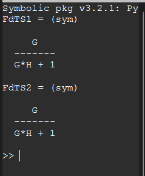
---
---


## 7. Demostrar que los siguientes sistemas no son equivalentes.

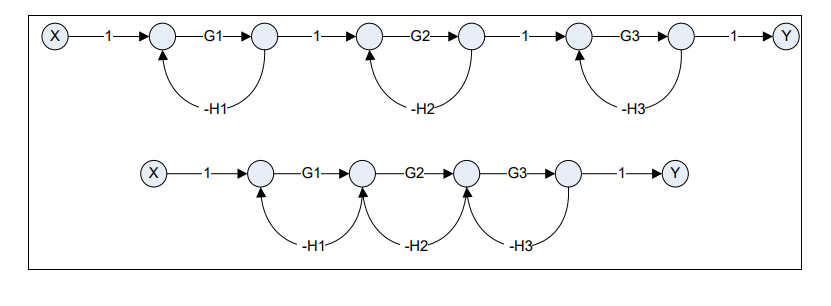
## 💻 Código en Octave

```octave
% Sistemas de Control
% Unidad 2 - Ejercicio 7
pkg load symbolic
close all; clear all; clc
% Definición de las funciones.
syms G1 G2 G3 H1 H2 H3 real
% Función de Transferencia del sistema 1.
M1=G1*G2*G3;
l1=-G1*H1;
l2=-G2*H2;
l3=-G3*H3;
D=1-(l1+l2+l3)+(l1*l2+l1*l3+l2*l3)-(l1*l2*l3);
D1=1;
disp('Función de Transferencia del Sistema 1')
FdTLCs1=factor(simplify(M1*D1/D),'s')
% Función de Transferencia del sistema 2.
M1=G1*G2*G3;
l1=-G1*H1;
l2=-G2*H2;
l3=-G3*H3;
D=1-(l1+l2+l3)+(l1*l3);
D1=1;
disp('Función de Transferencia del Sistema 2')
FdTLCs2=factor(simplify(M1*D1/D),'s')

```
## ⚙️ Resultados obtenidos
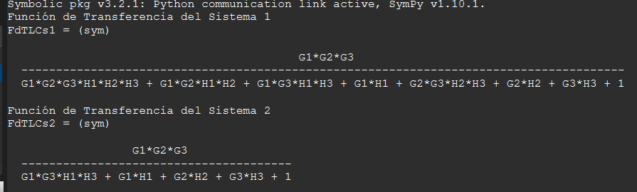
---

## 10. Aplicar la Regla de Mason para encontrar las siguientes Funciones de Transferencia

### Sistema 1: 
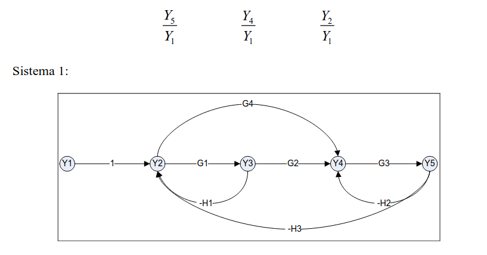
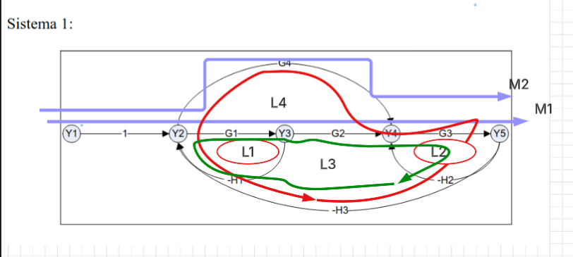

## 💻 Código en Octave

```octave
close all; clear all; clc
syms  G1 G2 G3 G4 H1 H2 H3 real

# CAMINOS DIRECTOS:
K=2;

# GANANCIA DE LOS CAMINOS DIRECTOS
M1 = 1*G1*G2*G3;
M2 = 1*G4*G3;

# LAZOS:
L1 = -H1*G1;
L2 = -H2*G3;
L3 = -H3*G1*G2*G3;
L4 = -H3*G4*G3;

# VALOR DEL DETERMINANTE
# TENIENDO EN CUENTA TODO EL DIAGRAMA
# DETERMINANTE = 1 - SUMATORIA DE GANANCIA DE LOS LAZOS
#                  + SUMATORIA LAZOS DISJUNTOS DE A 2
#                  - SUMATORIA LAZOS DISJUNTOS DE A 3 ETC
# LAZOS DISJUNTOS : "LAZOS QUE NO COMPARTEN NODOS"
DELTA = 1 - (L1+L2+L3+L4) + (L1*L2);

# GANANCIA DE LOS DELTA_K
# LO MISMO COMO EL DETERMINANTE PERO TENIENDO EN 
# CUENTA LOS CAMINOS DIRECTO
DELTA_K1 = 1 ;
DELTA_K2 = 1;

# FT = Y5 / Y1 = (M1*DELTA_K1 + M2*DELTA_K2) / DELTA
FT = (M1*DELTA_K1 + M2*DELTA_K2) / DELTA


```
## ⚙️ Resultados obtenidos
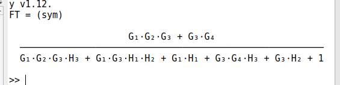


---

## 11. A partir de las ecuaciones que modelan matemáticamente el comportamiento dinámico de un motor de corriente continua, dibujar el diagrama de flujo de señal y determinar la función de transferencia entre la velocidad de salida y la tensión de entrada aplicando la fórmula de Mason

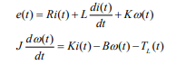
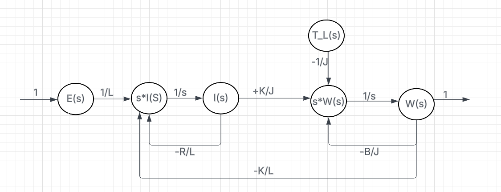
## 💻 Código en Octave

```octave


```
## ⚙️ Resultados obtenidos

---
